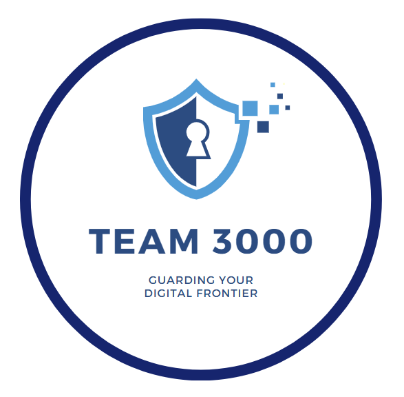

# Team3000

<p align="center">
  
  <br>
</p>


* Access our website through this link (xxxx)


## Table of Contents
- [Team Members](#team-members)
- [Project Overview](#project-overview)
- [Features](#features)
- [Step to Run Codes Locally](#step-to-run-codes-locally)
- [Tech Stack](#tech-stack)

## Team Members
| Team Member Name        | SMU Email Address                  |
|-------------------------|------------------------------------|
| Krysten Wong            | krystenwong.2023@scis.smu.edu.sg  |
| Lee Jia Wen             | jiawen.lee.2022@scis.smu.edu.sg   |
| Quek De Wang            | dewang.quek.2023@scis.smu.edu.sg  |
| Tan Wei Jun Brandon     | brandon.tan.2023@scis.smu.edu.sg  |

## Project Overview
Our solution is an NLP-powered data analytics tool designed for Internal Security Department (ISD) to process and analyze unstructured text data. It automates entity recognition, relationship mapping, topic modeling, and keyword search, converting raw text into structured insights. Users can upload datasets, clean errors, explore entity connections, detect key themes using LDA, and perform text search—all through interactive visualizations such as bar charts and network graphs. Built with Streamlit (frontend) and Python (Flask backend), the system is scalable and tailored for real-time intelligence analysis, enhancing threat detection and decision-making for ISD.


### Features
1. File Upload, Validation, and Error Resolution
   - Users can upload Excel files, and the system automatically detects and resolves errors like duplicates and missing values, ensuring data accuracy.

2. Entity Analysis
   - Extracts and visualizes key entities in a bar chart and relationship network graph, helping users identify patterns and connections.

3. Topic Modeling
   - Uses LDA to categorize text into meaningful topics, displaying key terms and trends for deeper content analysis.

4. Entity Search & Highlight Tool
   - Allows users to search for specific keywords, highlighting occurrences and providing quick insights into entity presence across documents.


## Step to Run Codes Locally
```
cd streamlit_app
```

```
py -3.9 -m venv spacy_env
```

```
spacy_env\Scripts\activate
```

```
pip install -r requirements1.txt
```

```
streamlit run build_dashboard.py
```

## Tech Stack
#### Frontend UI
- [](https://streamlit.io/)

#### Backend
- [](https://www.python.org/)

#### Data Processing & NLP
- [](https://pandas.pydata.org/)
- [](https://spacy.io/)
- [](https://radimrehurek.com/gensim/)
- [](https://scikit-learn.org/)

#### Data Visualization
- [](https://plotly.com/)
- [](https://matplotlib.org/)
- [](https://networkx.github.io/)

#### Deployment & Infrastructure
- [](https://streamlit.io/cloud)